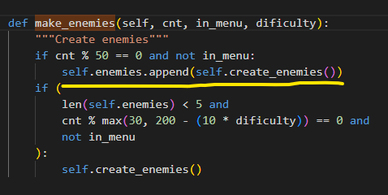

# PySpace - A Python Space Shooter

## Introduction

The game was created as a project for the course "Diploma in Software Development at Code Institute" in 2022. The requirement was to create an iteractive pure Terminal Python app deployed on a front end website. The game is a space shooter with a simple storyline. A space pilot who has to defend Earth from enemy ships. He can move his ship in all directions and shoot at the enemy ships. The game ends when the player loses all his lives. The best score is saved in a database and displayed on the website.

<a href="https://cligame.herokuapp.com" rel="nofolow">Visit and play the live version of the game here</a>

## Table of Contents

- [PySpace](#pyspace)
  - [Introduction](#introduction)
  - [Table of Contents](#table-of-contents)
  - [Strategy](#strategy)
  - [Technologies](#technologies)
  - [Features](#features)
    - [Main Page](#main-page)
    - [Options Menu](#options-menu)
    - [Rules Menu](#rules-menu)
    - [Results Menu](#results-menu)
    - [Game](#game)
  - [Testing](#testing)
  - [Unfixed Bugs](#unfixed-bugs)
  - [Features Left to Implement](#features-left-to-implement)
  - [Deployment](#deployment)
  - [Credits](#credits)
  - [Acknowledgements](#acknowledgements)

#### Strategy

- Game goal: Defend Earth from enemy ships

  - Player can move his ship in all directions
  - Can shoot at enemy ships
  - Best seven scores are saved in a database
  - Lives and score are displayed on the screen
  - Game ends when player loses all his lives

- User goals
  - Shoot at enemy ships
  - Do not let the eneny pass 

## Technologies

The technologies used in this project were the following:
  * HTML
  * CSS
  * JavaScript
  * Python

The diagram below show the main classes and interactions between them. Scene is the main class, it contains all data to be used and updated during the game and the methods to update the data. The screen data is updated during the game but just rendered once in the "run_game" function. The game is rendered in the terminal using the "curtsies" library https://github.com/bpython/curtsies. The library was required to both render the game without blinking, but also to receive input from any pressed key. Beside the "curtsies" library, the game uses the "random" library to generate random numbers, the "time" library to set the game speed and the gspread and oauth2client libraries to connect to the Google Sheets database. The game is deployed on Heroku and the database is hosted on Google Sheets.

## Features

### Main Page

When the user opens the website, the page is displayed with the game title, the game description, rules and a message to press the start button to start the game.

The menu is displayed in the terminal. The user can navigate through the menu with the arrow keys and press Enter key to select an option. 

### Start option

Once the user selects the start option, the game starts. 

### Records Menu

The user can select the records option to see the best seven scores saved in the database.

### About Menu

When the user selects the about option, a window with the game autor and version is displayed.

### Game

The game is played on a 90x30 terminal screen. There are three enemy ships that move in random directions. 

Main ship:

Alien ships in the order of strength 0 - 4:

 |  |  |  |
 

The ship lives are got from the equation: (type_ship + 1) * 2. For example, the ship 0 has live 2. The ship 4 has lives 9.

New enemies and movement rules can be easilly added to the game. 

## Testing

The manual testing was done by playing the game and checking the functionality of the game and printing necessary information on the terminal screen.
The code is tested with the PEP8 pylint extension in VS Code. To pass the pylint test, the code had to be refactored to meet the pylint requirements. The pylint score is 10/10.

## Unfixed Bugs

- After playing for a while the game starts to slow down. I could not find why it is slowing down. In the proccess, using debug, I found an error that it could also be affecting speed.

On the image bellow is possible to see that I was adding a new enemy ship to the list of enemies. I was appending twice, resulting in a None being added to the list. I fixed the bug, but the game still slows down.

- I have tried both cProfile and memory profiler, but I cound not find it.

- The game is not responsive to the terminal window size. It was designed to be played on a 90x30 terminal window. If the window is smaller, the game is not displayed correctly. If the window is bigger, it can get slow.

- During the development process, I have also discovered that one of the ships had one character less in one line. It was crashing the render function depending on the position of the ship. I fixed the bug after hours running the debugger.

Problematic ship removed:

 |

## Features Left to Implement

There are few ideas left to be implemented:
- Make enemies shoot at the player
- Add random power ups to change the player gun or add extra lives
- Add a boss enemy
- Add a level system
- Make better enemies movement

## Deployment

- The game was deployed on Heroku. The code is stored in a GitHub repository. The repository is connected to Heroku and the deployment is automatic.

## Credits

- curtsies example and documentation: without understanding the curtsies library, the game would not be possible. 
- The slack community for the support and help.

## Acknowledgements

- Curtsies example and documentation: without understanding the curtsies library, the game would not be possible.
- Rick Van Hatten, for the book Mastering Python and which I used as a reference for better development practices.
