# PySpace - A Python Space Shooter

## Introduction

The game was created as a project for the course "Diploma in Software Development at Code Institute" in 2022. The requirement was to create an iteractive pure Terminal Python app deployed on a front end website. The game is a space shooter with a simple storyline. A space pilot who has to defend Earth from enemy ships. He can move his ship in all directions and shoot at the enemy ships. The game ends when the player loses all his lives. The best score is saved in a database and displayed on the website.

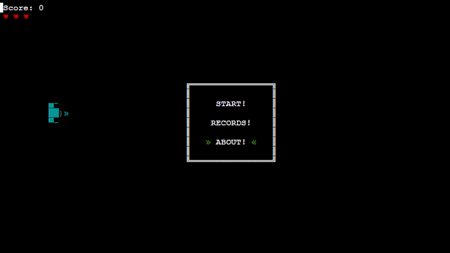

<a href="https://cligame.herokuapp.com" rel="nofolow">Visit and play the live version of the game here</a>

## Table of Contents

- [PySpace](#pyspace)
  - [Introduction](#introduction)
  - [Table of Contents](#table-of-contents)
  - [Strategy](#strategy)
  - [Technologies](#technologies)
  - [Features](#features)
    - [Main Page](#main-page)
    - [Options Menu](#options-menu)
    - [Rules Menu](#rules-menu)
    - [Results Menu](#results-menu)
    - [Game](#game)
  - [Testing](#testing)
  - [Unfixed Bugs](#unfixed-bugs)
  - [Features Left to Implement](#features-left-to-implement)
  - [Deployment](#deployment)
  - [Credits](#credits)
  - [Acknowledgements](#acknowledgements)

#### Strategy

- Game goal: Defend Earth from enemy ships

  - Player can move his ship in all directions
  - Can shoot at enemy ships
  - Best seven scores are saved in a database
  - Lives and score are displayed on the screen
  - Game ends when player loses all his lives

- User goals
  - Shoot at enemy ships
  - Do not let the eneny pass 

## Technologies

The technologies used in this project were the following:
  * HTML
  * CSS
  * JavaScript
  * Python

The diagram below show the main classes and interactions between them. Scene is the main class, it contains all data to be used and updated during the game and the methods to update the data. The screen data is updated during the game but just rendered once in the "run_game" function. The game is rendered in the terminal using the "curtsies" library https://github.com/bpython/curtsies. The library was required to both render the game without blinking, but also to receive input from any pressed key. Beside the "curtsies" library, the game uses the "random" library to generate random numbers, the "time" library to set the game speed and the gspread and oauth2client libraries to connect to the Google Sheets database. The game is deployed on Heroku and the database is hosted on Google Sheets.

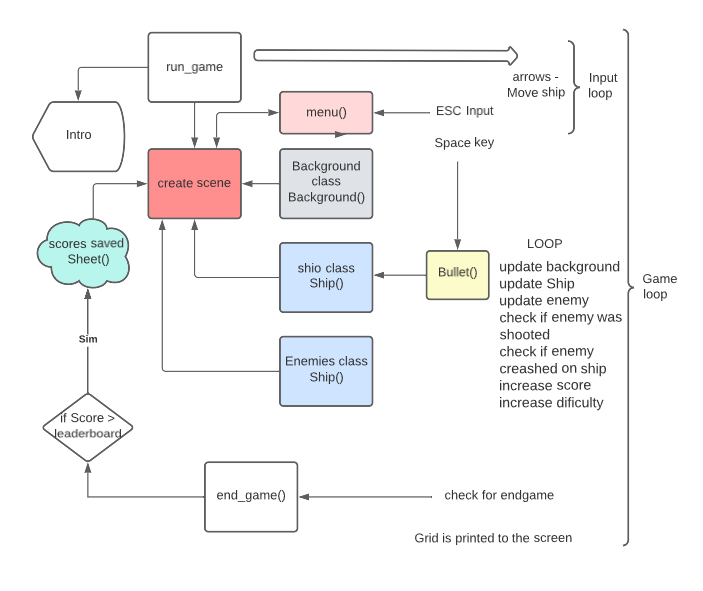

## Features

### Main Page

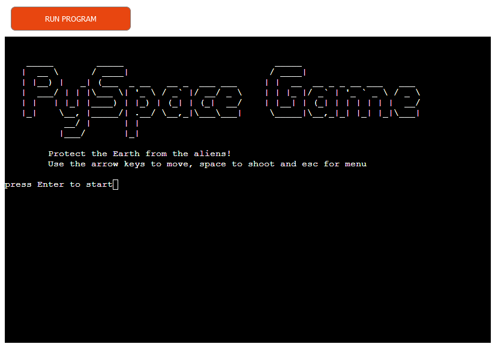

When the user opens the website, the page is displayed with the game title, the game description, rules and a message to press the start button to start the game.

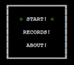

The menu is displayed in the terminal. The user can navigate through the menu with the arrow keys and press Enter key to select an option. 

### Start option

Once the user selects the start option, the game starts. 

### Records Menu

The user can select the records option to see the best seven scores saved in the database.

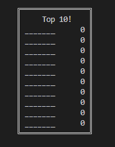

### About Menu

When the user selects the about option, a window with the game autor and version is displayed.

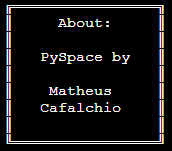

### Game

The game is played on a 90x30 terminal screen. There are three enemy ships that move in random directions. 

Main ship:

Alien ships in the order of strength:

alien 0:                                                         | alien 1:                                                          |  alien 2:
:---------------------------------------------------------------:| :----------------------------------------------------------------:| :----------------------------------------------------------------:| 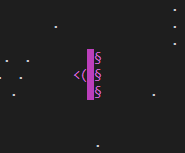 | 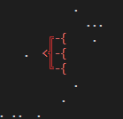 | 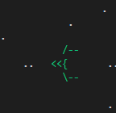 |

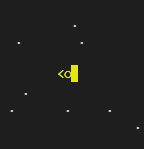|
 
 

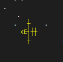
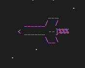

The ship lives are got from the equation: (type_ship + 1) * 2. For example, the ship 0 has live 2. The ship 5 has lives 12.

New enemies and movement rules can be easilly added to the game. 

## Testing

The manual testing was done by playing the game and checking the functionality of the game and printing necessary information on the terminal screen.
The code is tested with the PEP8 pylint extension in VS Code.

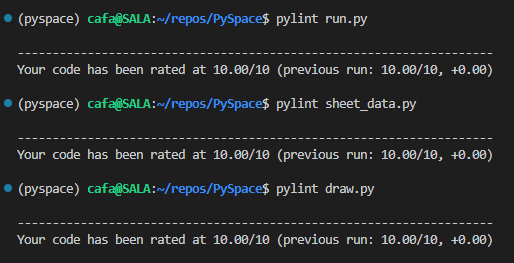

## Unfixed Bugs

- Based on the checkers rules, the player needs to capture as many pieces as possible. The game is not programmed to do that neither to check if the player is taking the best possible move. The game is programmed to force a take.

- The computer is not programmed to take the best possible move. The computer is programmed to take a random piece.

- It was reported to crash in Android, but I was not able to reproduce the error.

## Features Left to Implement

- Implement a better AI for the computer.
- A timer to limit the time of each player.
- A smoother animation for the pieces moving.
- In the future, a multiplayer mode.

## Deployment

- The game was deployed on Heroku. The code is stored in a GitHub repository. The repository is connected to Heroku and the deployment is automatic.

## Credits

- Stack Overflow
- Guido, my mentor
- w3Schools
- This channel that teaches cheker's https://www.youtube.com/watch?v=WD3NTNQElew
- developer.mozilla.org (where I passed most of my time)

## Acknowledgements

- My mentor for saving me from starting in a wrong way, which would make the project impossible to finish.
- My colleagues for the slack channel.
- The tutors for the help.
- My last hackathon team which tested the game and gave great feedbacks
